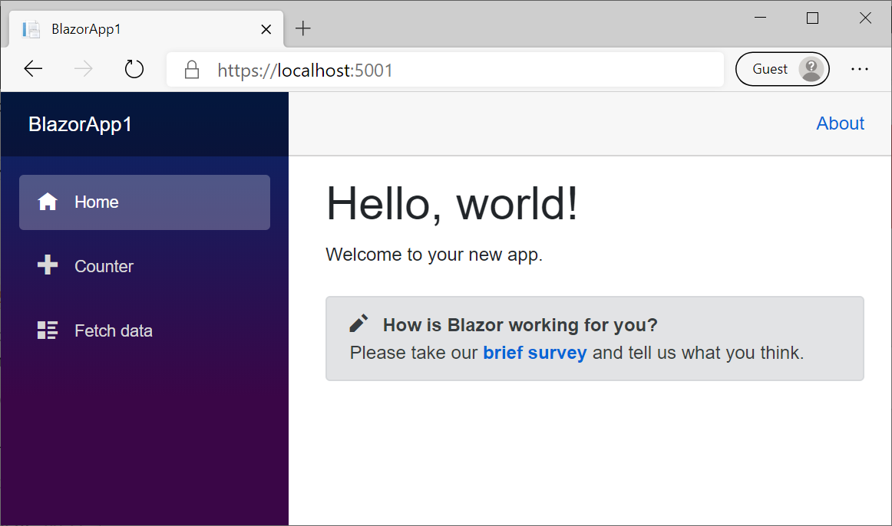

<div style="width:60%; margin-left:20%;">

#  Get started

<div style="text-align:right;">

###### [[ <= BACK ]](02.md) | [[ < HOME > ]](00.md) | [[ NEXT => ]](02.3.md)

</div>

---

## Запуск

Через **`dotnet-cli`**:

```cmd
cd BlazorApp1
dotnet run
```

После запуска у вас появится возможность перейти в браузере по адресу https://localhost:5001 и увидеть свое первое **`Blazor WebAssembly`**-приложение:



---

<div style="text-align:right;">

###### [[ <= BACK ]](02.md) | [[ < HOME > ]](00.md) | [[ NEXT => ]](02.3.md)

</div>

</div>
