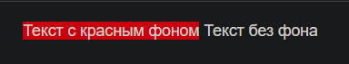

<div style="width:80%; margin-left:10%;">

#  Additional features

<div style="text-align:right;">

###### [[<= BACK]](04.md) | [[< HOME >]](00.1.md) | [[NEXT =>]](07.md)

</div>

---

## Изоляция стилей

---

##### `MyComponent.razor`

```html
<span class="my-class">Текст с красным фоном</span>
```

##### `MyComponent.razor.css`

```css
.my-class {
  background-color: red;
}
```

##### `OtherComponent.razor`

```html
<span class="my-class">Текст без фона</span>
```

##### `Index.razor`

```csharp
@page "/"

<MyComponent />
<OtherComponent />
```

### Результат



---

<div style="text-align:right;">

###### [[<= BACK]](04.md) | [[< HOME >]](00.1.md) | [[NEXT =>]](07.md)

</div>

</div>
